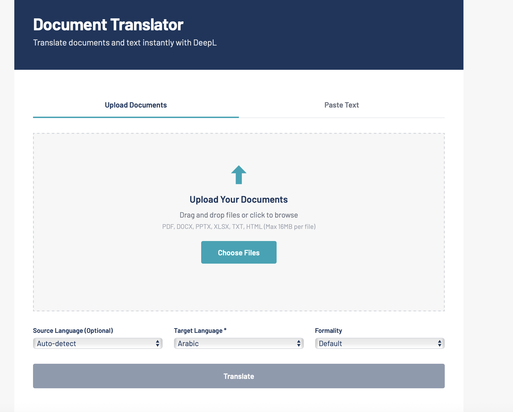

# Document Translator

A simple, secure web application for translating documents using the DeepL API. Built with Flask and styled with EDC's brand design.




## Features

- 📄 **Document Translation** - Upload PDF, DOCX, PPTX, XLSX, TXT, HTML files
- ✏️ **Text Translation** - Paste and translate text directly
- 🌐 **30+ Languages** - All languages supported by DeepL
- 🎯 **Auto-detect** - Automatically detects source language
- 🎨 **Formality Control** - Choose formal or informal tone
- 📥 **Download** - Get translated documents with preserved formatting
- 🖱️ **Drag & Drop** - Easy file upload interface

## Quick Start

### 1. Clone the Repository

```bash
git clone https://github.com/yourusername/document-translator.git
cd document-translator
```

### 2. Install Dependencies

```bash
pip3 install -r requirements.txt
```

### 3. Get a DeepL API Key

1. Sign up at [DeepL API](https://www.deepl.com/pro-api)
2. Choose Free (500K chars/month) or Pro plan
3. Copy your API key

### 4. Configure Environment

```bash
cp .env.example .env
```

Edit `.env` and add your API key:

```
DEEPL_API_KEY=your_api_key_here
```

### 5. Run the Application

```bash
python3 app.py
```

Open http://localhost:5000 in your browser.

## Usage

### Document Translation
1. Click "Upload Document" tab
2. Drag & drop or select a file
3. Choose target language and formality
4. Click "Translate"
5. Download the translated document

### Text Translation
1. Click "Paste Text" tab
2. Enter or paste your text
3. Choose target language
4. Click "Translate"
5. Copy the result

## Supported File Types

| Type | Extension |
|------|-----------|
| PDF | `.pdf` |
| Word | `.docx` |
| PowerPoint | `.pptx` |
| Excel | `.xlsx` |
| Text | `.txt` |
| HTML | `.html` |

## Configuration

| Variable | Description | Required |
|----------|-------------|----------|
| `DEEPL_API_KEY` | Your DeepL API key | Yes |

## File Size Limit

Maximum file size: **16 MB**

## Tech Stack

- **Backend**: Python, Flask
- **Frontend**: HTML, CSS, JavaScript
- **Translation**: DeepL API
- **Font**: Barlow (Google Fonts)

## Project Structure

```
document-translator/
├── app.py              # Flask application
├── requirements.txt    # Python dependencies
├── .env.example        # Environment template
├── templates/
│   └── index.html      # Frontend UI
├── uploads/            # Temporary uploads (gitignored)
└── translated/         # Translated files (gitignored)
```

## Contributing

Contributions are welcome! Please read [CONTRIBUTING.md](CONTRIBUTING.md) for guidelines.

## License

This project is licensed under the MIT License - see [LICENSE](LICENSE) for details.

## Acknowledgments

- [DeepL](https://www.deepl.com/) for the translation API
- [EDC](https://edc.org/) for design inspiration
- Japanese
- And many more...

## Technical Stack

- **Backend**: Flask (Python)
- **Frontend**: HTML, CSS, JavaScript
- **Translation**: DeepL API
- **Document Processing**:
  - PyPDF2 for PDF files
  - python-docx for Word documents

## Troubleshooting

### "DeepL API key not configured" error
- Make sure you've set the `DEEPL_API_KEY` environment variable
- Verify your API key is valid

### "No text could be extracted" error
- The document might be scanned (image-based) rather than text-based
- Try using a different document
- For scanned PDFs, you'll need OCR capabilities

### Translation fails
- Check your DeepL API quota
- Verify your internet connection
- Ensure the source document contains valid text

## License

MIT License - Feel free to use and modify as needed.
